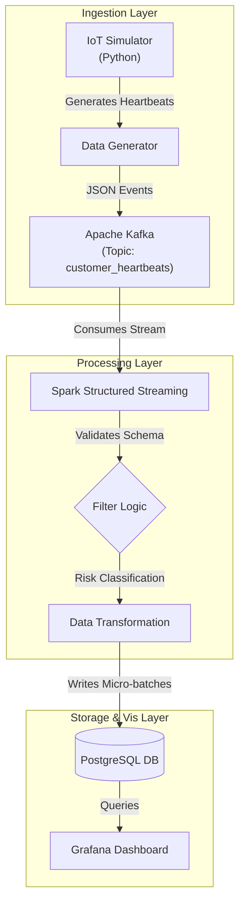

# Real-Time Customer Heartbeat Monitoring System

A scalable data engineering pipeline that simulates, processes, and stores real-time customer heartbeat data using **Kafka**, **Spark Structured Streaming**, and **PostgreSQL**.

## System Architecture



The system consists of three main stages:

1.  **Ingestion Layer**: 
    *   `src/producer/simulator.py`: Simulates IoT devices generating heartbeat data (via `HeartbeatGenerator`).
    *   **Kafka**: Buffers the high-velocity data stream.
2.  **Processing Layer**: 
    *   `src/consumer/spark_processor.py`: Uses Spark Structured Streaming to consume data from Kafka, schema validation, and micro-batch processing.
3.  **Storage Layer**: 
    *   **PostgreSQL**: Stores the processed heartbeat records for analytics.

## Prerequisites

*   **Docker & Docker Compose**: For running Kafka, Zookeeper, and PostgreSQL.
*   **Python 3.9+**: For running the producer and consumer.
*   **Java 17**: Required for Spark.

## Setup & Installation

1.  **Clone the Repository**
    ```bash
    git clone https://github.com/jill-break/Real-Time-Customer-Heartbeat-Monitoring-System.git
    ```

2.  **Environment Configuration**
    Ensure your `.env` file matches the Docker configuration:
    ```ini
    KAFKA_BROKER=localhost:9092
    KAFKA_TOPIC=customer_heartbeats
    DB_HOST=127.0.0.1
    DB_PORT=5433
    DB_NAME=monitoring_db
    DB_USER=admin
    DB_PASS=password123
    ```

3.  **Start Infrastructure**
    Spin up the Docker containers (Kafka, Zookeeper, Postgres):
    ```bash
    docker-compose up -d
    ```

4.  **Install Dependencies**
    ```bash
    pip install -r requirements.txt
    ```

## Running the Pipeline

You need to run the **Producer** and **Consumer** in separate terminals.

### Terminal 1: Consumer (Start this first)
Initializes the database and waits for data.
```bash
python main.py consumer
```

### Terminal 2: Producer
Starts generating and sending synthetic heartbeat data.
```bash
python main.py producer
```

## Data Schema

**PostgreSQL Table: `heartbeats`**
| Column | Type | Description |
| :--- | :--- | :--- |
| `id` | BIGINT IDENTITY | Unique record ID |
| `customer_id` | UUID | Customer Identifier (e.g., 550e8400-e29b...) |
| `heart_rate` | INT | BPM Value (30-220) |
| `event_time` | TIMESTAMP | Time of reading (Indexed) |
| `risk_level` | VARCHAR | Calculated risk (Normal, Elevated, High) |
| `ingested_at` | TIMESTAMP | System insertion time |

## Dashboards
 
### Grafana (Metrics)
*   **URL**: http://localhost:3000
 *   **Credentials**: `admin` / `admin`
 
### Kafka UI (Stream Monitoring)
*   **URL**: http://localhost:8080
*   inspect topics, messages, and consumer groups in real-time.

## Testing & CI/CD
 
### Local Testing
Run the comprehensive test suite using `pytest`:
```bash
python -m pytest tests/
```
 
### CI Pipeline
A GitHub Actions workflow (`.github/workflows/ci.yml`) automatically runs tests on every `push` and `pull_request` to `main`.
*   **Environment**: Python 3.9, Java 17, Ubuntu Latest.
*   **Triggers**: Commits to main branch.
